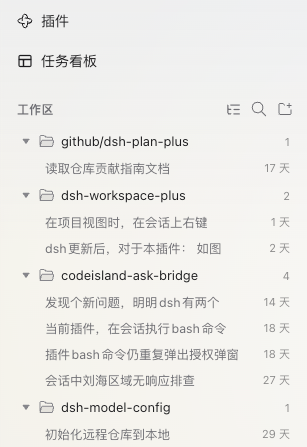
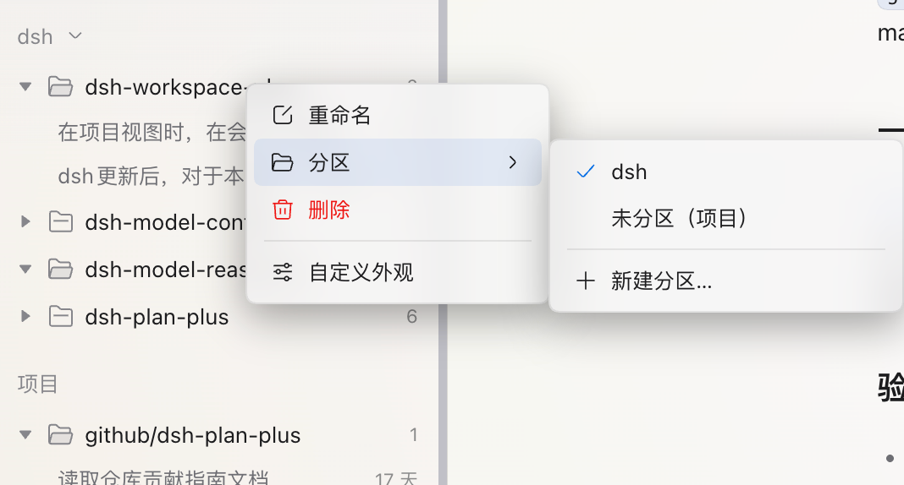
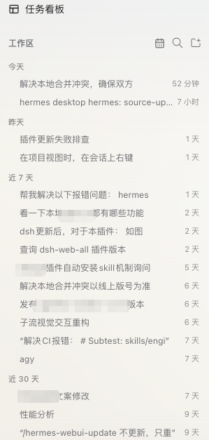
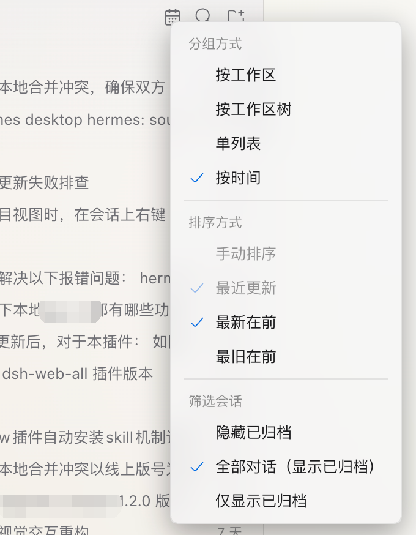
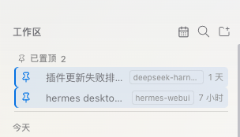
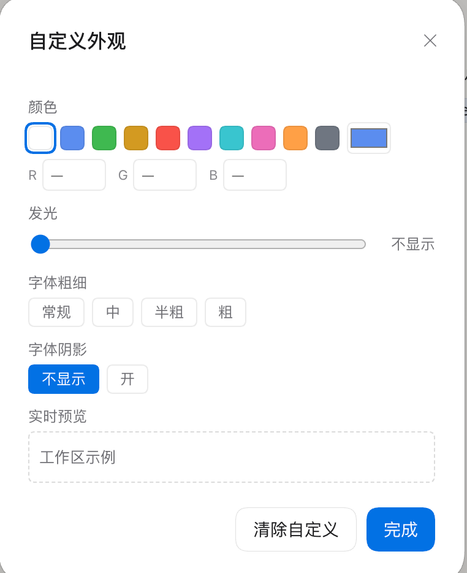
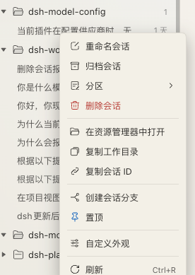

# dsh-workspace-plus

[English](./README_EN.md) | **简体中文**

[](https://awesome-dsh-plugin.com)

> Fork of [KannaKuron/dsh-better-workspace](https://github.com/KannaKuron/dsh-better-workspace)

> 给 [DeepSeek Harness (DSH)](https://www.npmjs.com/package/@deepseek-ai/dsh) 的侧边栏「工作区」列表装上一套**文件夹系统**——工作区还是那个工作区(一个目录),但名字里的 `/` 就是层级,让「网页前端」「网页后端」这类工作区可以归到同一个 `web` 分组下。

```
github/                 ← 虚拟分组(不是真实目录,纯命名层级)
└─ dsh-plan-plus        ← 工作区「github/dsh-plan-plus」
dsh-workspace-plus      ← 原有的单层工作区照常工作
codeisland-ask-bridge
dsh-model-config
```

## 功能与效果

### 层级树

<table>
<tr>
<td align="center" width="48%"></td>
<td valign="top"><b>层级树（项目视图）</b><br/>工作区名称里的 <code>/</code> 即分组：如 <code>github/dsh-plan-plus</code> 自动归入 <code>github</code> 虚拟分组，支持任意多级；单层工作区（如 <code>dsh-workspace-plus</code>）照常显示在根层。重命名工作区后树<b>即时重排</b>——分组只是名字的投影，没有第二份需要同步的数据。</td>
</tr>
</table>

### 添加工作区:选完文件夹,再选「所属分组」

点「添加工作区」并选完文件夹后,弹出一个小对话框,一行选择工作区所属分组——直接输入(如 `web`)、从下拉里选已有层级(datalist 原生补全),留空就是根分组。确认后插件创建工作区并把分组前缀写进名称,树上自然落位。对话空态页的「添加工作区」走的也是这条交互,同样带分组弹窗。

### 分组的增删,全在右键

右键任意分组行即可:**新增子分组**(路径自动带上父分组前缀)、**新增子工作区**(选完目录后所属分组输入框自动预填)、重命名分组、删除空分组;标题栏不放独立按钮。空分组持久保存在浏览器本地;一旦有工作区落进去,分组就由名称自然派生。

### 搜索

侧栏搜索按钮,按名称即时过滤**工作区、独立分组与会话**(本地标题过滤);搜索时树自动全部展开。宿主级内容搜索(`session.search`)计划后续接回。

### 工作区与会话分区

<table>
<tr>
<td align="center" width="55%"></td>
<td valign="top" width="45%">
  <b>独立分区管理</b><br/>
  右键工作区或会话 → <b>分区</b>，选择已有分区、<b>未分区（项目）</b>或<b>新建分区…</b>。<br/><br/>
  会话操作只移动当前会话；工作区操作连同该工作区的所有会话一起移动，包括此前单独分区的会话。会话可选择<b>跟随所属工作区</b>来撤销独立分区。<br/><br/>
  分区为单层结构，工作区与会话共用分区列表。单独分区的会话直接显示在分区下，带所属工作区角标。分区标题可折叠、可拖拽放置。
</td>
</tr>
</table>

右键工作区或会话 → **分区**，选择已有分区、**未分区（项目）**或**新建分区…**。会话操作只移动当前会话；工作区操作连同该工作区的所有会话一起移动，包括此前单独分区的会话。会话可选择**跟随所属工作区**来撤销独立分区。新建时自动移入当前右键对象；右键分区标题也可创建空分区。顶部图标区不提供创建分区或会话分支入口。

分区为单层结构，工作区与会话共用分区列表。单独分区的会话直接显示在分区下，带所属工作区角标。分区标题可折叠；将工作区或会话拖到分区标题即可移动，拖到“项目”即可移回未分区。折叠分区和空分区也能接收，放入后自动展开；置顶、归档和未分组会话也支持拖入分区。最近更新排序下仍可移动分区，显示顺序继续按最近更新排列；搜索时暂停拖拽。

工作区与会话分别按 ID 保存归属，不修改名称、目录或宿主的工作区会话关联。右键分区标题可重命名或删除；删除前会确认，工作区移回“项目”，单独分区的会话恢复跟随所属工作区。分区及折叠状态保存在当前浏览器。分区在工作区树和工作区视图中显示；单列表、时间视图仍平铺会话。原有名称路径分组保留在“项目”区域，独立分区内显示工作区完整名称。

### 视图配置

<table>
<tr>
<td align="center" width="45%"></td>
<td valign="top" width="55%">
  <br/><br/>
  <b>单键切换视图</b><br/>
  侧边栏标题栏的视图按钮预览当前形态（工作区、树、列表或日历），菜单分为「分组方式 / 排序方式 / 筛选会话」，设置 → 插件 → 插件配置里也有等效选项。<br/><br/>
  <b>时间视图（单一全局时间线）</b><br/>
  跨项目所有会话聚合展示，按「今天 / 昨天 / 近 7 天 / 近 30 天 / 更早」分桶（本地时区自然日），空桶自动隐藏，名称分组此时隐去；方向可选「最新在前 / 最旧在前」。悬浮会话条时，行尾相对时间互换为所属项目小角标（并出现置顶按钮），条目下方弹出官方 Tooltip 气泡（不透明深底，两行：完整标题 + 项目 · 绝对时间）。
</td>
</tr>
</table>

- **按工作区树**(默认)：名称分组树，保留多级文件夹、单链折叠与外观定制。
- **按工作区**：各独立分组与“项目”区域内平铺工作区，使用完整名称；切换视图或跨名称分组重排均不改名。
- **单列表**：跨工作区平铺会话，悬浮时显示所属工作区角标；手动顺序沿用宿主工作区与其会话顺序，请在工作区视图中拖拽调整。
- **按时间**：跨工作区按「今天 / 昨天 / 近 7 天 / 近 30 天 / 更早」分桶，支持最新 / 最旧在前。
- **排序方式**：手动排序 / 最近更新独立于分组方式。最近更新按可见会话时间排列工作区、虚拟分组与组内会话，只改变显示顺序；切回手动恢复宿主原顺序。自动排序、单列表与时间视图关闭重排拖拽，置顶区仍保持最近置顶在前。
- **筛选会话**：隐藏已归档(默认) / 全部对话 / 仅显示已归档，统一作用于各视图与搜索。仅归档模式隐藏无匹配会话的工作区和空分组；空态提供「查看全部对话」。归档行带标识，右键或悬浮按钮可取消归档；取消归档后才可打开。旧宿主没有恢复接口时禁用恢复入口。
- 偏好持久化在当前浏览器，旧版项目 / 时间视图与排序偏好继续兼容。

### 会话置顶

<table>
<tr>
<td align="center" width="45%"></td>
<td valign="top" width="55%">
  <b>全局置顶托盘</b><br/>
  任意会话（含未分组）右键「置顶 / 取消置顶」，或行悬浮时点击图钉按钮即可置顶。<br/><br/>
  <b>全局已置顶区</b>固定在列表最顶：跨工作区聚合、最近置顶在前、行尾带所属工作区小角标、点击直开（自动跨工作区切换）；被置顶的会话在原工作区/未分组区内<b>隐藏</b>（只在置顶区展示，取消置顶即回归原位），收起的工作区行保留图钉计数徽标。<br/><br/>
  置顶行带品牌色小图钉 + 弱底色 + 左侧强调条，与「当前会话高亮」可叠加。纯显示层投影（不改会话顺序/标题），状态跨重启持久；删除后自动取消置顶，归档期间从置顶区隐藏，选择显示归档时在普通列表展示；置顶记录保留，取消归档自动回归置顶区。
</td>
</tr>
</table>

### 拖拽

工作区行拖到另一工作区行上/下半即调整顺序(写回宿主序),拖到分组行即移入该分组;会话行同工作区内拖到另一会话上/下半重排,拖到会话子分组行即移动进该分组。拖拽工作区期间,单链合并显示的行临时展开回文件夹树——路径里每一级都是可投放的分组行,松手后自动合并。显示顺序 = 宿主手动序,拖拽结果立即生效(自动排序、单列表、时间模式、归档行与置顶行不参与重排)。

### 状态一目了然

会话行沿用官方状态灯语义:**生成中**(蓝色运行环)、**等待批准 / 计划确认 / 回答**(琥珀)、**已完成**(绿色提醒)、**{n} 个子任务运行中**(子代理计数);有活动定时任务的会话显示闹钟角标(与官方行一致)。**状态呼吸灯**(可在设置关闭):被折叠藏起的状态沿层级向外冒泡——工作区/分组行图标按状态色呼吸发光(自定义过文字发光的标题一起呼吸),会话分组行显示呼吸状态灯;运行蓝只在本层呼吸、不外渗。

### 外观自定义

<table>
<tr>
<td align="center" width="58%"></td>
<td valign="top"><b>外观自定义</b><br/>右键任意一层(工作区分组 / 工作区 / 会话 / 会话分组)→「自定义外观」:颜色(9 预设色板 + 取色器 + RGB 输入)、发光强度(0..14 拖动条,只作用于文字光晕)、字体粗细(常规/中/半粗/粗)、字体阴影开关、图标(71 个:3 种文件夹形态 + 68 个 dsh 原语图标;图标仅对工作区与工作区分组行生效),底部带实时预览。清除自定义一键复原。</td>
</tr>
<tr>
<td align="center" width="58%"></td>
<td valign="top"><b>改完即见</b><br/>颜色、文字发光、字体粗细、阴影与图标按行应用,和展开状态一起经 dsh 客户端 store 持久化在当前浏览器。</td>
</tr>
</table>

### 单链折叠

设置卡里的开关(默认开):一层恰好只有一个子级时合并显示为一行(如 `测试层1` 挂着 `AI交易` → `测试层1/AI交易`),出现多个子级时自动还原为树;拖拽工作区期间临时展开,任意一级可投放。

### 不丢原生能力

- 会话行:打开 / 重命名 / 分叉 / 归档;每工作区「新会话」(点 + 总是先展开该工作区,让新会话立刻可见);当前会话高亮;未分组会话兜底。
- **URL/斜杠标题不拆层**:宿主自动生成的会话标题落地时若含 `/`(如复述了 URL),整串自动包上 `“”` 原样显示,绝不解析成层级——只对本次启动后**新建的会话**生效,并等命名稳定(约 20 秒,让原生 AI 命名先落地)才处理;存量会话与你手动命名的 `/` 分组标题永不被改动。引号内(含手动添加)的 `/` 永不切分,孤立引号只当普通字符;无引号但含 URL 的旧标题也有平铺兜底。
- 中英双语跟随界面语言;会话行行尾显示相对时间(悬浮时让位)。

### 右键菜单

<table>
<tr>
<td align="center" width="40%"></td>
<td valign="top" width="60%">
  <b>会话右键菜单</b><br/>
  右键菜单把操作收进一处，并按功能划分清晰分组：
  <ul>
    <li><b>会话管理</b>：重命名、归档、分区（移入已有分区/新建分区/跟随工作区）、删除会话（永久删除，红色高亮带确认）。</li>
    <li><b>路径与系统</b>：在资源管理器中打开（定位会话目录）、复制工作目录、复制会话 ID。</li>
    <li><b>派生与常驻</b>：创建会话分支（创建后自动打开分支会话）、置顶（快捷加入置顶区）。</li>
    <li><b>外观定制</b>：自定义外观（独立配置行颜色、文字发光、字体粗细与阴影）。</li>
    <li><b>界面工具</b>：刷新（支持 <code>Ctrl+R</code> 快捷键）。</li>
  </ul>
</td>
</tr>
</table>

工作区行支持重命名、删除、自定义外观；工作区分组行支持新增子分组、新增子工作区、重命名分组（同步更新组内所有工作区名称）、删除空分组、自定义外观；会话分组支持重命名、自定义外观。

目录优先取目标会话的 `cwd`，缺失时使用所属工作区路径，未分组会话也可使用自己的目录。已归档会话提供取消归档、删除、目录和复制操作。

永久删除由本插件的宿主半实现（`POST /dsh-workspace-plus/delete-session`；DSH 只有归档、没有删除 RPC）。删除前会确认；确认后宿主先停止运行中的任务、脱离 live session，再只删除「位于 `DSH_HOME/sessions` 下且目录名与会话 ID 完全一致」的目录，随后清理投影缓存与工作区记账。删除成功后清除本插件的置顶记录并刷新会话列表；被拒绝时（目录缺失、子代理会话、缺少持久化服务、路径越界）提示会给出失败阶段与原因。

## 安装

将插件安装到 DSH 正在使用的 profile。桌面端通常使用 `desktop`，Web 版通常使用 `web`。

```bash
# DSH 桌面端
dsh plugin --profile desktop add https://github.com/lsdt45/dsh-workspace-plus.git

# DSH Web
dsh plugin --profile web add https://github.com/lsdt45/dsh-workspace-plus.git
```

安装完成后**重启 DSH** 即生效。

### 更新

从 Git 安装的插件可按 profile 更新：

```bash
dsh plugin --profile desktop update dsh-workspace-plus
```

如果使用的是 Web profile，将 `desktop` 替换为 `web`。更新后重启 DSH。

### 使用本地源码预览

将路径替换为本地仓库的绝对路径：

```bash
dsh plugin --profile desktop add /absolute/path/to/dsh-workspace-plus
```

本地目录会以 link 依赖加入该 profile。修改源码后重启 DSH，即可加载本地版本。Web profile 同理，将 `desktop` 改为 `web`。

### 卸载

```bash
dsh plugin --profile desktop remove dsh-workspace-plus
```

卸载后重启 DSH。Web profile 请使用 `--profile web`。

## 工作原理

DSH 的侧边栏浏览区是一个公开插槽 `sidebar.workspaces`(single),官方工作区浏览器是它的占用者;本插件以更低优先级注册同一插槽,**整区替换**为层级树版本。数据全部来自插槽标准注入(`useWorkspaces` / `useSessions` 快照钩子),动作(打开会话、重命名/删除工作区、归档等)也走注入的宿主动作——不碰任何私有 API。

「添加工作区」则落在 dsh 专门为第三方设计的一条缝里:`sidebar.workspaces.directoryFlow` 与 `conversation.hero.workspace.directoryFlow` 两个目录流插槽。触发按钮、忙碌语义、错误弹窗全由官方持有;本插件只拥有「触发之后、交付路径之前」的交互——正好用来塞进「选完文件夹 → 弹窗选分组 → 创建 → 改名加前缀」这条链。

视图状态(分组折叠、会话展开、显式空分组)、外观自定义与插件设置都通过 dsh 客户端 store 持久化在浏览器本地(`dsh.betterWorkspace.view.v1`)。注意:该 store 的 hydration 是整值替换、不合并默认值——升级后如果遇到状态字段缺失,重启前的旧状态按旧结构保留,缺的键自动回退默认。

## 开发

```bash
npm pack        # 出 tarball 后可本地安装验证
```

本地验证:把 `npm pack` 产出的 tarball 装进 web profile 并手动挂载(见上),重启 DSH,验证:层级树渲染、添加工作区弹窗、重命名即时重排、新建分组、卸载后回到原浏览器。

## License

[MIT](./LICENSE)
