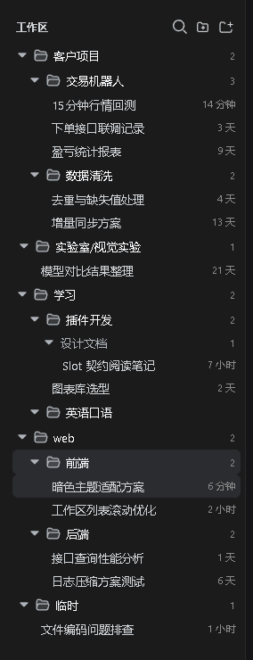
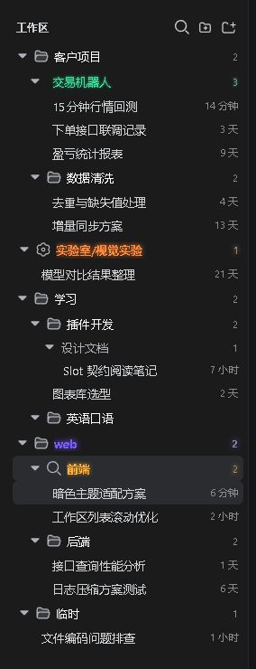

# dsh-workspace-plus

[](https://awesome-dsh-plugin.com)

> **Fork of [KannaKuron/dsh-better-workspace](https://github.com/KannaKuron/dsh-better-workspace)** adding **projects/time dual views** and **session pinning** on top of the hierarchy tree; independent version line starting at 0.1.0. Existing browser state (folders/expansion/prefs/styling) migrates seamlessly.

> A **folder system** for the DeepSeek Harness (DSH) sidebar workspace list — a workspace is still one directory, but every `/` in its name becomes hierarchy, so `web/frontend` and `web/backend` group under one virtual `web` folder.

```
web/                 <- virtual folder (naming only, not a real directory)
|- frontend          <- workspace "web/frontend"
`- backend           <- workspace "web/backend"
```

## Features & preview

<table>
<tr>
<td align="center" width="58%"></td>
<td valign="top"><b>Hierarchical tree</b><br/>Every `/` in a workspace title creates a virtual folder: web/frontend and web/backend sit under one web group, arbitrarily deep; workspaces without a `/` stay at the root. Renaming a workspace re-derives the tree <b>instantly</b> — folders are a projection of names, there is no second source of truth.</td>
</tr>
</table>

### Add flow: pick a folder, then pick a group

After you pick a directory for a new workspace, a small dialog asks for the parent group — type one (`web`), pick an existing level from the datalist, or leave it empty for the root. The plugin creates the workspace and writes the prefix into its title, so it lands on the right branch of the tree.

### Folder create/delete via context menu

Right-click any folder row: new subfolder (parent prefix pre-filled), new workspace here (the add-flow group field pre-fills with this folder), rename folder, delete empty folder — no standalone header button anymore. Explicit empty folders persist in the browser until workspaces live inside them.

### Sessions follow the same rule

Session titles nest on `/` too (e.g. `test1/plugin maintenance`). Session groups render in a secondary color without a folder icon, so they are clearly distinct from workspace folders; a session group can be renamed as a whole (rewrites member titles).

<table>
<tr>
<td align="center" width="58%"></td>
<td valign="top"><b>Appearance customization</b><br/>Right-click any row (workspace folder / workspace / session / session group) → Customize: color (swatches + picker + RGB), glow strength (0–14 slider, text only), font weight, font shadow, an icon grid (69 icons from the dsh primitives family, workspace &amp; folder rows only), with a live preview at the bottom. Reset returns to default in one click.</td>
</tr>
<tr>
<td align="center" width="58%"></td>
<td valign="top"><b>Applied immediately</b><br/>Color, text glow, font weight, shadow and icon apply per row and persist, together with expansion state, via the dsh client store in the current browser.</td>
</tr>
</table>

<table>
<tr>
<td align="center" width="58%"></td>
<td valign="top"><b>Context menu everywhere</b><br/>Actions live in the right-click menu: workspace rows — rename / delete / fork / archive / customize; folder rows — new subfolder / new workspace here / rename group (updates all descendant workspaces) / delete empty group / customize; session &amp; session-group rows — rename / fork / archive / customize.</td>
</tr>
</table>

<table>
<tr>
<td align="center" width="58%"></td>
<td valign="top"><b>Settings card</b><br/>Settings → Plugins → Configuration adds a “Better Workspaces” card (official accordion style) with a <b>single-child-chain merge</b> toggle (e.g. level1 containing only AI trade renders as one row level1/AI trade) and a <b>status breathing light</b> toggle (status dots hidden by collapse bubble outward as breathing glows; on by default); expansion state and styling persist via the dsh client store in the browser.</td>
</tr>
</table>

### More highlights

- **Projects / time dual views (fork addition)**: a view button in the sidebar header (the icon previews the active view — a tree for the projects view, a calendar for the time view; popup menu, single-select) plus equivalent segmented controls in Settings → Plugins → Configuration. **Projects view** = the default title-grouped tree (with drag reordering); **Time view** = ONE global timeline across projects: every visible session from all workspaces joins the same stream, bucketed by **today / yesterday / last 7 days / last 30 days / earlier** (local calendar days) and mixed across projects, empty buckets hidden, title groups yield; a row tail shows the relative time since the last message by default, and on hover the time swaps for the workspace tag (plus the pin button), while the official primitives Tooltip bubble pops right under the session row (opaque dark surface, two lines: full title + project · absolute timestamp); with a **Latest / Oldest first** direction sub-choice shown while the time view is active. The preference persists per browser. In the time view session reorder drags are disabled by design (visual order is not the host order); the projects view keeps group-drop drags.
- **Session pinning (fork addition)**: right-click → Pin, or the pin button on row hover, for any session including ungrouped ones. The **global Pinned section** stays at the very top: cross-workspace, most-recent pin first, each row tagged with its workspace name, click opens it directly (switching workspaces); a pinned session is **hidden inside its workspace / the ungrouped area** (tray-only display — unpinning restores it), and a collapsed workspace row keeps a pin-count badge. Pinned rows carry a small brand-colored pin glyph, subtle tint and a left accent bar, stacking cleanly with the current-session highlight; the title always stays readable (compact tag, and under very narrow containers the relative time yields). Pinning is a pure display-layer projection (no reordering, no renames), persists across restarts, auto-unpins hard-deleted sessions, and hides (but keeps) pins of archived sessions until unarchive.
- **Folder-style collapse**: clicking a workspace row collapses/expands all of its sessions (the row keeps a session counter when collapsed); session groups collapse too; search force-expands everything.
- **Native drag restored**: drag a workspace row above/below another to reorder (writes back the host registry order) or onto a folder row to move it into that group; drag session rows to reorder within the same workspace or onto a session group to move. Display order = host manual order, drag results are visible immediately (time modes and pinned rows never act as reorder anchors). While dragging a workspace, merged single-chain rows (e.g. work/A) temporarily re-expand into folder rows — every level of the path becomes a drop target, and chains merge back when the drag ends.
- **Native capabilities kept**: open/rename/fork/archive sessions, per-workspace new-session (the + button always expands the workspace first so the new session is immediately visible), current-session highlight, official status dots (blue running ring / amber pending / green done), **status breathing lights** (dots hidden by collapse bubble outward: workspace/folder rows breathe on their icon in the status color — amber pending / green done, custom-glow labels breathe along; running breathes blue only on the session row itself and never relays; off-able in settings), **active-schedule badge** (alarm clock icon for sessions with active Schedule records, matching the official rows), ungrouped-session fallback, zh/en localization.
- **Slash-bearing titles never nest from URLs**: when a host-generated session title lands containing `/` (e.g. echoing a pasted URL), it is auto-wrapped in `“”` and shown verbatim — only for sessions **created after this launch**, and only once the name stays stable for ~20s (letting the native AI naming land first); pre-existing sessions and your manually named `/` groupings are never touched. Quotes (manual ones too) never split on `/`, and a lone quote is just an ordinary character; unquoted URL tails still fall back flat.
- **Conversation hero too**: the empty-state “Add workspace” menu uses the same picking interaction with the same group popup.

## Install

```bash
dsh plugin --profile web add dsh-workspace-plus
# Dev link: install the fork into a profile with a link: dependency (see AGENTS.md)
```

Plain JavaScript, zero build, zero npm dependencies (dsh client baseline modules only). Restart DSH after installing.

## How it works

The sidebar browsing region is the public `sidebar.workspaces` slot; this plugin registers the same slot with a lower priority and replaces the shipped browser with the tree. All data flows through the slot’s standard snapshot hooks and injected host actions — no private APIs.

The add flow lands in the seam dsh designed for third parties: the two `directoryFlow` holes. The trigger, busy semantics, and error dialog stay official; this plugin owns everything between the trigger and the adopted path — exactly enough room for pick → group popup → create → prefixed rename.

View state (folder collapse, session expansion, explicit empty folders), custom styling and plugin settings persist browser-side via the dsh client store (`dsh.betterWorkspace.view.v1`).

## Relationship to dsh-better-sidebar

Same `dsh-better-*` family, zero overlap: [dsh-better-sidebar](https://github.com/omdsh-dev/DSH-better-sidebar) is the VSCode-like panel on the right; this plugin only takes over the left workspace list. They can be installed together.

## Limitations / roadmap

- A session dragged onto a session row **inside another group** only gets reordered in the flat list (its title group stays); drag onto the group row or rename to move it.
- Search is local title filtering; host content search (`session.search`) is planned.
- Explicit empty folders persist per-browser (roadmap: host-side folder registry + settings page).
- The flat view is not taken over; the hierarchical tree is the view.

## Develop

```bash
npm test        # smoke: manifest consistency / baseline require whitelist / dictionary alignment / syntax
npm pack        # tarball for local install verification
```

## License

[MIT](./LICENSE)
