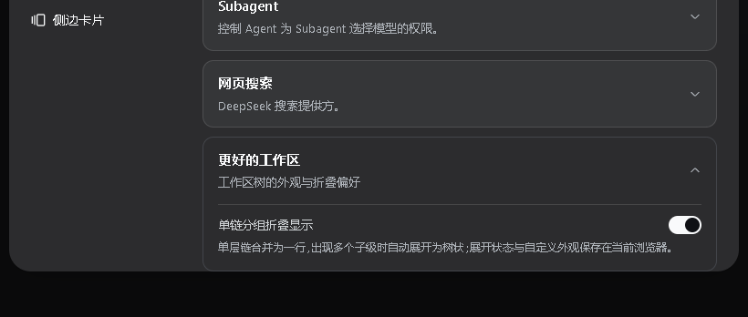

# dsh-workspace-plus

[](https://awesome-dsh-plugin.com)

> **Fork of [KannaKuron/dsh-better-workspace](https://github.com/KannaKuron/dsh-better-workspace)** (the upstream is KannaKuron's original work — not itself a fork — and part of the dsh-better-\* plugin family) adding **projects/time dual views**, **session pinning** and **search** on top of the hierarchy tree; independent version line starting at 0.1.0. Existing browser state (folders/expansion/prefs/styling) migrates seamlessly.

> A **folder system** for the DeepSeek Harness (DSH) sidebar workspace list — a workspace is still one directory, but every `/` in its name becomes hierarchy, so `web/frontend` and `web/backend` group under one virtual `web` folder.

```
web/                 <- virtual folder (naming only, not a real directory)
|- frontend          <- workspace "web/frontend"
`- backend           <- workspace "web/backend"
```

## Features & preview

<!--
Screenshots to be added later (place into docs/screenshots/ and update refs):
- 1-workspace-tree.png   hierarchical tree (existing)
- time view, pinned tray, search (to be added)
-->

### Hierarchical tree

<table>
<tr>
<td align="center" width="58%"></td>
<td valign="top"><b>Hierarchical tree</b><br/>Every `/` in a workspace title creates a virtual folder: web/frontend and web/backend sit under one web group, arbitrarily deep; workspaces without a `/` stay at the root. Renaming a workspace re-derives the tree <b>instantly</b> — folders are a projection of names, there is no second source of truth.</td>
</tr>
</table>

### Add flow: pick a folder, then pick a group

After you pick a directory for a new workspace, a small dialog asks for the parent group — type one (`web`), pick an existing level from the datalist, or leave it empty for the root. The plugin creates the workspace and writes the prefix into its title, so it lands on the right branch of the tree. The empty-state "Add workspace" menu in the conversation uses the same interaction with the same group popup.

### Folder create/delete via context menu

Right-click any folder row: new subfolder (parent prefix pre-filled), new workspace here (the add-flow group field pre-fills with this folder), rename folder, delete empty folder — no standalone header button. Explicit empty folders persist in the browser until workspaces live inside them.

### Search

The sidebar search button filters **workspaces and sessions** by name instantly (local title filtering); the tree force-expands while searching, and pinned rows stay in their search-result positions. Host-level content search (`session.search`) is planned.

### Projects / time dual views (fork addition)

<!-- Screenshot to be added: time view -->

Toggle from the sidebar view button (the icon previews the active view — a tree for projects, a calendar for time); an equivalent segmented control lives in Settings → Plugins → Configuration.

- **Projects view** (default): the title-grouped tree with drag reordering; a row tail shows the relative time since the last message.
- **Time view**: ONE global timeline across projects — every visible session joins the same stream, bucketed by **today / yesterday / last 7 days / last 30 days / earlier** (local calendar days), empty buckets hidden, title groups yield; direction is **latest / oldest first**. On hover, the row's relative time swaps for its workspace tag (and the pin button appears), and the official primitives Tooltip pops right under the row (opaque dark surface, two lines: full title + project · absolute timestamp); the tag is hover-revealed here, while pinned-tray rows always show theirs.
- The preference persists per browser. In the time view session reorder drags are disabled by design (visual order is not the host order); the projects view keeps group-drop drags.

### Session pinning (fork addition)

<!-- Screenshot to be added: pinned tray -->

Right-click → Pin / Unpin, or the pin button on row hover, for any session including ungrouped ones. The **global Pinned section** stays at the very top: cross-workspace, most-recent pin first, each row tagged with its workspace name, click opens it directly (switching workspaces); a pinned session is **hidden inside its workspace / the ungrouped area** (tray-only — unpinning restores it), and a collapsed workspace row keeps a pin-count badge. Pinned rows carry a small brand-colored pin glyph, subtle tint and a left accent bar, stacking cleanly with the current-session highlight. Pinning is a pure display-layer projection (no reordering, no renames), persists across restarts, auto-unpins hard-deleted sessions, and hides (but keeps) pins of archived sessions until unarchive.

### Drag & drop

Drag a workspace row above/below another to reorder (writes back the host order) or onto a folder row to move it into that group; drag session rows to reorder within the same workspace, or onto a session group to move. While dragging a workspace, merged single-chain rows temporarily re-expand into folder rows — every level of the path becomes a drop target, and chains merge back when the drag ends. Display order = host manual order, drag results are visible immediately (time mode and pinned rows never act as reorder anchors).

### Status at a glance

Session rows keep the official status-light semantics: **running** (blue ring), **waiting for approval / plan review / answer** (amber), **completed** (green reminder), and **{n} subagent(s) running** (subagent count); sessions with active scheduled tasks show an alarm-clock badge (matching official rows). The **status breathing light** (toggleable in settings): status dots hidden by collapse bubble outward — workspace/folder rows breathe on their icon in the status color (custom-glow labels breathe along), session-group rows show a breathing dot; the running blue breathes only on the session row itself and never relays.

### Appearance customization

<table>
<tr>
<td align="center" width="58%"></td>
<td valign="top"><b>Appearance customization</b><br/>Right-click any row (workspace folder / workspace / session / session group) → Customize: color (9 swatches + native picker + RGB input), glow strength (0–14 slider, text glow only), font weight (regular/medium/semibold/bold), font shadow toggle, an icon grid (71 icons: 3 folder-glyph modes + 68 dsh primitives icons; icons apply to workspace &amp; workspace-folder rows only), with a live preview at the bottom. Reset returns to default in one click.</td>
</tr>
<tr>
<td align="center" width="58%"></td>
<td valign="top"><b>Applied immediately</b><br/>Color, text glow, font weight, shadow and icon apply per row and persist, together with expansion state, via the dsh client store in the current browser.</td>
</tr>
</table>

### Single-chain collapse

A toggle in the settings card (on by default): a level with exactly one child merges into one row (e.g. `level1` holding `AI trade` renders as `level1/AI trade`); with multiple children it re-expands into a tree; during workspace drags it temporarily re-expands so any level is a drop target.

### Native capabilities kept

- Session rows: open / rename / fork / archive; per-workspace new session (the + button always expands the workspace first so the new session is immediately visible); current-session highlight; ungrouped-session fallback.
- **Slash-bearing titles never nest from URLs**: when a host-generated session title lands containing `/` (e.g. echoing a pasted URL), it is auto-wrapped in `“”` and shown verbatim — only for sessions **created after this launch**, and only once the name stays stable for ~20s (letting the native AI naming land first); pre-existing sessions and your manually named `/` groupings are never touched. Quotes (manual ones too) never split on `/`, and a lone quote is just an ordinary character; unquoted URL tails still fall back flat.
- zh/en localization follows the UI language; session rows show a relative time at the tail (yields on hover).

## Settings card

<table>
<tr>
<td align="center" width="58%"></td>
<td valign="top"><b>Settings → Plugins → Configuration</b><br/>A "Better Workspaces" card (official accordion style) with a <b>single-chain merge</b> toggle, a <b>status breathing light</b> toggle and a <b>projects/time</b> segmented switch (direction options appear while the time view is active). Expansion state and styling persist via the dsh client store in the browser.</td>
</tr>
</table>

Context menus keep every action one click away: workspace rows — rename / delete / fork / archive / customize; folder rows — new subfolder / new workspace here / rename group (updates all descendant workspaces) / delete empty group / customize; session &amp; session-group rows — rename / fork / archive / pin / customize.

<!-- Screenshot to be added: context menu (5-context-menu.png exists, reusable) -->

## Install

```bash
# once the npm package is published
dsh plugin --profile web add dsh-workspace-plus
# dev link: install into a profile via a link: dependency (restart DSH after edits)
# or: npm pack, then pnpm add <tarball> inside the profile
```

Plain JavaScript, zero build, zero npm dependencies (dsh client baseline modules only). Restart DSH after installing.

## How it works

The sidebar browsing region is the public `sidebar.workspaces` slot; this plugin registers the same slot with a lower priority and replaces the shipped browser with the tree. All data flows through the slot's standard snapshot hooks and injected host actions — no private APIs.

The add flow lands in the seam dsh designed for third parties: the two `directoryFlow` holes. The trigger, busy semantics, and error dialog stay official; this plugin owns everything between the trigger and the adopted path — exactly enough room for pick → group popup → create → prefixed rename.

View state (folder collapse, session expansion, explicit empty folders), custom styling and plugin settings persist browser-side via the dsh client store (`dsh.betterWorkspace.view.v1`). Note: that store's hydration replaces the whole value without merging defaults — after an upgrade, a stale state keeps its old shape and missing keys fall back to defaults.

## Relationship to dsh-better-sidebar

Same `dsh-better-*` family, zero overlap: [dsh-better-sidebar](https://github.com/omdsh-dev/DSH-better-sidebar) is the VSCode-like panel on the right; this plugin only takes over the left workspace list. They can be installed together.

## Limitations / roadmap

- A session dragged onto a session row **inside another group** only gets reordered in the flat list (its title group stays); drag onto the group row or rename to move it.
- Search is local title filtering; host content search (`session.search`) is planned.
- Explicit empty folders persist per-browser (roadmap: host-side folder registry + settings page).
- The flat view is not taken over; the hierarchical tree is the view.

## Develop

```bash
npm test        # smoke: manifest consistency / baseline require whitelist / dictionary alignment / syntax
npm pack        # tarball for local install verification
```

## License

[MIT](./LICENSE)
